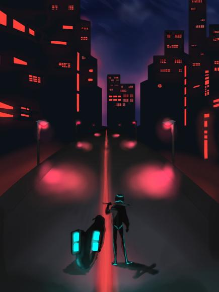

# 「Cyburst -サイバースト-」

# 作品概要
- 2022年度（2年次）に、チームで制作した3Dスクロールアクションゲーム「Cyburst」の公開用リポジトリです。
- ジャンル  
3Dスクロールアクションゲーム
- 開発期間  
2022/6/1～2023/1/10
- チーム構成（計8名）  
プランナー3名/プログラマー2名/デザイナー3名  
私はプログラマーとして参加しました。
- 開発環境  
Unity2021.3.9f1  
VisualStudio2022  
GitHub  
VisualStudioCode

# プレイ動画
## 実演動画（約1分30秒）
- スタートからクリアまでの一連の流れを収めた動画です。
https://drive.google.com/file/d/1VXBb6mTb8m74fOsVhSzIFPKcw2meAf_5/view?usp=sharing
# 担当箇所
インゲーム
 - プレイヤー（移動、打つ、モーション）
 - 敵ドローン（弾発射を除く）
 - 障害物、（コーン、フェンス）
 - バット、バイクモーション
 - ステージ制御
 - UI（スコア、時間制限、ターゲット選択、バリア）
 - ゲームパッド、キーボード対応  
アウトゲーム
  - Scene遷移
  - UI（ボタン選択、ボタンと背景のモーション）
  - サウンド実装
# 担当ソースコード
E_Manager.cs  
BE_Manager.cs  
E_StoneScript.cs  
P_Manager.cs  
BatManager.cs  
StageManager.cs  
S_C_Menu.cs
S_C_SelectMenu.cs  
AnimationUI.cs  
U_GetScore.cs  
U_RuleChange.cs  
U_Score.cs  
U_TimeCounter.cs  
CloseWindow.cs